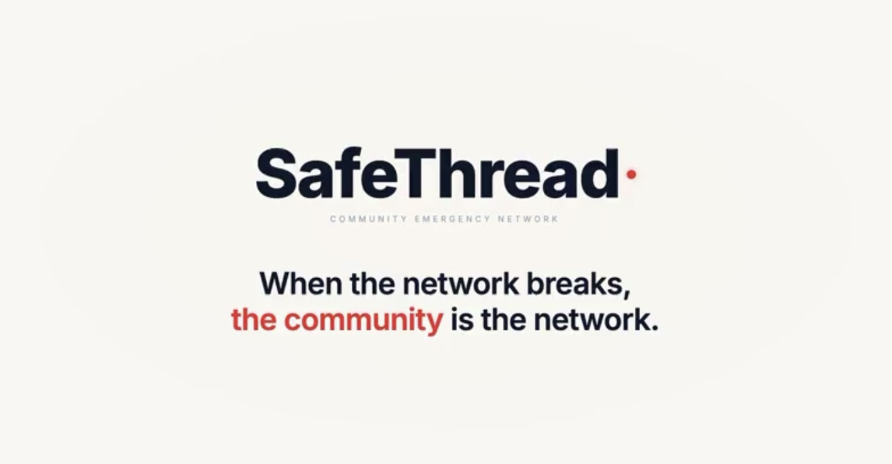

<p align="center">
  
</p>

# SafeThread

> A field-coordination platform for NGOs operating in low-connectivity warzones. Civilians signal sightings and needs over **SMS, app push, and a Bluetooth-mesh app (bitchat)**. SafeThread fuses those signals through an **LLM-driven matching engine**, surfaces the right cases to operators in a console, and broadcasts decisions back over the same channels — push-first.

---

## What it actually does (in plain language)

A child goes missing in Aleppo. The family member walks into an NGO field office or texts a tip line. Half the city has no internet; cell towers are intermittent; some people only have a $10 dumbphone. SafeThread lets the NGO:

1. **Take that report** through whatever channel reached them — typed at a console, an SMS, an app push, or a Bluetooth message that hopped phone-to-phone until it hit someone with internet.
2. **Triage it automatically.** A small LLM classifies every inbound: *missing person · medical · resource shortage · safety · noise · bad actor*. Nothing legitimate gets dropped because an operator was busy.
3. **Coalesce the noise.** When 200 people text about the same incident, the system groups them into one case (by alert, region, time window) so an operator looks at one cohesive view, not 200 rows.
4. **Broadcast back out.** Operator (or the agent, for safe actions) sends an Amber Alert to the right audience: civilians in that region, an NGO partner, or a rescue team. The system prefers free push; falls back to SMS; falls back to bitchat mesh when nothing else works.
5. **Thread replies onto the case.** Civilians who text a sighting back land directly on that case's timeline — not in an undifferentiated inbox. (See [How an Amber Alert flows](#how-an-amber-alert-flows) below.)

The product is **operator-in-the-loop by design.** Low-risk actions (recording a sighting, tagging a case) auto-execute. High-blast-radius actions (mass broadcasts, marking someone a bad actor) route to the operator console as suggestions to approve, edit, or reject.

---

## How an Amber Alert flows

This is the round-trip you can demo end-to-end on a laptop with a Twilio number and an ngrok tunnel:

1. **Operator creates a case** in the NGO console — `Michiel, 29 — male, white · last seen JPH, Amsterdam`. The system allocates a 4-character civilian-facing **reply code** (e.g. `K883`) and shows it on the case header.
2. **Operator clicks Send Amber Alert.** The composer auto-drafts the SMS body:
   ```
   AMBER ALERT — Michiel, 29 — male, white. Last seen JPH, Amsterdam.

   Reply: "K883 <your message>"
   ```
3. **Civilians get the SMS** (push if they have the app; otherwise SMS via Twilio; otherwise bitchat mesh hop).
4. **Civilian replies** by text: `K883 Saw him near Centraal Station 14:30`.
5. **Inbound webhook strips the prefix**, looks up the active alert by code, sets `in_reply_to_alert_id`, and persists the message. The triage worker buckets it onto that case.
6. **The case timeline updates live** in the operator console: the new reply appears on the case (not in the global wire), the case `MSG` count ticks up, and the operator sees a real conversation building.

A reply without the code prefix still shows up — but on the global wire as an unthreaded civilian message, with a *Make a case* affordance for the operator. So the system degrades gracefully when civilians forget the code.

For a fuller walkthrough with diagrams (including the BLE store-and-forward path for civilians who have no cell), see [`visuals/README.md`](visuals/README.md).

---

## Status

- **Matching engine + console:** end-to-end on `main`. Inbound → triage → buckets → agent → console works in real mode (Opus 4.7) and stub mode (no API key needed).
- **SMS round-trip:** Twilio outbound + inbound webhook + reply-code threading: shipped.
- **DTN library + mesh transport adapters:** shipped on the `matching-engine` branch.
- **Real outbound dispatcher** (push + audience cascade): roadmap.
- **Hub-side BLE radio:** stretch goal (skeleton lands the right shape; needs a Pi to validate).

---

## Architecture at a glance

Five execution nodes, four DB-coupled stages, one operator-in-the-loop surface. Every contract is a Postgres table; every node is restartable, replayable, auditable.

```
                        ┌─────────────────────────────────────────────┐
                        │              CIVILIAN DEVICES               │
                        │  (SafeThread iOS — bitchat-derived)         │
                        │   SMS  ·  app push  ·  BLE mesh             │
                        └────────────────┬────────────────────────────┘
                                         │
        ┌────────────────────────────────┼────────────────────────────┐
        │                                │                            │
        ▼                                ▼                            ▼
   carrier SMS              POST /api/sim/inbound (HTTP)     POST /app/dtn/deliver
   (sms_base)                                                (DTN sealed bundle)
        │                                │                            │
        └────────────────┬───────────────┴────────────┬───────────────┘
                         │                            │
                         ▼                            ▼
               ┌─────────────────────┐    ┌──────────────────────────┐
               │   API tier          │    │  DTN dispatcher          │
               │ (FastAPI mailroom)  │    │  decode · seal-open      │
               │                     │    │  amber / sighting / chat │
               └──────────┬──────────┘    └──────────┬───────────────┘
                          │                          │
                          ▼                          ▼
                  ┌──────────────────────────────────────┐
                  │           InboundMessage             │  ← DB-as-bus
                  └─────────────────┬────────────────────┘
                                    │ NOTIFY new_inbound
                                    ▼
                  ┌──────────────────────────────────────┐
                  │  Triage worker  (Haiku)              │
                  │  classify · geocode · dedupe · embed │
                  └─────────────────┬────────────────────┘
                                    │ NOTIFY bucket_open
                                    ▼
              ┌───────────────────────────────────────────────┐
              │   Bucket (alert_id, geohash_4, time_window)   │  ← coalescing primitive
              └─────────────────────┬─────────────────────────┘
                                    │ pg_advisory_lock(alert)
                                    ▼
                  ┌──────────────────────────────────────┐
                  │  Agent worker  (Sonnet/Opus)         │
                  │  retrieve → reason → 14 tools        │
                  └─────────────────┬────────────────────┘
                                    │
                  ┌─────────────────┴────────────────────┐
                  ▼                                      ▼
          AgentDecision row                 ToolCall rows (execute or suggest)
                  │                                      │
                  │                                      ├── auto_executed → dispatcher
                  │                                      └── pending → operator console
                  ▼                                      ▼
               WS /ws/stream  ────►  NGO console (web/)
                                     ▲
                                     │ approve / reject / compose
                                     │
                              human operator
                                     │
                                     ▼
                            Outbound dispatcher
                            (push → SMS → mesh)
```

For the full breakdown — node-by-node contracts, all 17 tables, every API endpoint, the agent's tool surface, and the operating envelope — see [`ARCHITECTURE.md`](ARCHITECTURE.md).

---

## Quick start

### One-step Docker (demo-ready)

```bash
echo "ANTHROPIC_API_KEY=sk-ant-..." > .env   # gitignored; LLM is optional, see below
docker compose up -d --build
```

Open `http://localhost:8080`. The image runs migrations and starts the workers; with `SEED_ON_BOOT=true` (compose default) it also lands a populated demo scene. Set `SEED_ON_BOOT=false` in `.env` to start with an empty database.

**Without an `ANTHROPIC_API_KEY`** the triage and agent workers fall back to deterministic stubs — the demo still runs, the wire still moves, you just won't see real LLM reasoning in the console.

### Hot-reload dev

```bash
docker compose up -d db                    # Postgres + pgvector only
uv sync && uv run alembic upgrade head
uv run uvicorn server.main:app --reload --port 8080

cd web && npm install && npm run dev       # Vite on :5173, proxies API → :8080
```

### Inbound SMS via Twilio

The reply-code round-trip needs Twilio creds + a public webhook URL:

```bash
# .env
TWILIO_ACCOUNT_SID=...
TWILIO_AUTH_TOKEN=...
TWILIO_FROM_NUMBER=+1234567890
TWILIO_DEMO_RECIPIENT=+316...   # trial accounts can only message verified numbers

# expose your local backend
ngrok http 8080
# then in the Twilio console set the SMS webhook to:
#   https://<your-tunnel>.ngrok.io/webhooks/twilio/sms
```

### Deploying for an NGO (boxd.sh)

We ship to **[boxd.sh](https://boxd.sh)** — a one-command VM platform with a built-in TLS-terminating subdomain proxy. An NGO can be live in under 10 minutes with no infra knowledge.

```bash
# 1. From your laptop — provision a VM with a memorable name.
ssh boxd.sh
boxd create safethread        # creates safethread.boxd.sh with TLS

# 2. Open a shell on the VM.
boxd connect safethread

# 3. Clone + create .env (all secrets stay on the VM, never committed).
git clone https://github.com/<your-fork>/anth-hackathon26.git
cd anth-hackathon26
cat > .env <<'EOF'
ANTHROPIC_API_KEY=sk-ant-...                 # required for real-LLM mode
APP_PASSWORD=changeme                        # shared operator login
SEED_ON_BOOT=false                           # NGO deploy = clean DB
REPLAY_AUTOSTART=false                       # no demo drip in production
TWILIO_ACCOUNT_SID=AC...
TWILIO_AUTH_TOKEN=...
TWILIO_FROM_NUMBER=+1...                     # buy a number in the Twilio console
TWILIO_DEMO_RECIPIENT=+316...                # optional: pin every send to one phone
TWILIO_MAX_RECIPIENTS=25
RESCUE_TEAM_RECIPIENTS="+316...:Alice,+44...:Bob"   # quote if any name has spaces
EOF

# 4. Boot.
docker compose up -d --build
```

The console is now live at **`https://safethread.boxd.sh`** with TLS, the login screen, and an empty database ready for real traffic.

**Wire Twilio so SMS replies land on the deploy:**
1. Twilio console → Phone Numbers → Active Numbers → click your number.
2. Messaging Configuration → "A message comes in" → **Webhook** → `https://safethread.boxd.sh/webhooks/twilio/sms` → **HTTP POST** → save.

**Updating after a code change**:
```bash
git pull && docker compose up -d --build
```
The Postgres volume persists across rebuilds (`pgdata`), so cases, accounts, and history survive. To wipe and start clean: `docker compose down -v`.

---

## Repo layout (top level)

```
server/      FastAPI app + asyncio workers (triage, agent, heartbeat)
web/         React/Vite NGO console
mobileapp/   bitchat-derived iOS app with SafeThread store-and-forward
alembic/     DB migrations
docs/        Specs and plans
visuals/     Architecture diagrams aimed at non-technical readers
tests/       pytest, one file per domain
```

For the deeper map (`server/api/`, `server/workers/`, `server/dtn/`, `server/transports/`), see [`ARCHITECTURE.md` §3](ARCHITECTURE.md#3-backend--five-nodes-four-db-coupled-stages).

---

## Tests

```bash
uv run pytest                # 98 passing on main; +29 DTN tests on matching-engine
uv run pytest -k agent       # agent-worker focused
uv run pytest -k dtn         # DTN library (matching-engine)
uv run pytest -k transport   # mesh adapters (matching-engine)
```

For the real-LLM path: `scripts/smoke_real_agent.py` does a one-shot end-to-end test with a real `ANTHROPIC_API_KEY`. Validates SDK connect, multi-turn loop, tool dispatch, persistence. Costs ~$0.06 per run.

---

## Key environment variables

All settable via `.env` or the host shell.

| Var | Default | Effect |
|---|---|---|
| `DATABASE_URL` | `postgresql+asyncpg://app:app@db:5432/matching` | Postgres URL |
| `ANTHROPIC_API_KEY` | — | enables real Haiku triage + Opus 4.7 agent. Without it, both fall back to deterministic stubs. |
| `JWT_SECRET` | `change-me` | NGO operator JWT signing |
| `APP_PASSWORD` | — | shared password the operator console asks for on first load. Empty = no gate. |
| `HEARTBEAT_INTERVAL_SEC` | `300` | how often the heartbeat scheduler ticks each active alert |
| `HEARTBEAT_ENABLED` | `true` | `false` to skip the heartbeat task entirely |
| `SEED_ON_BOOT` | `true` (compose) | run the demo seeder if the DB is empty |
| `REPLAY_AUTOSTART` | `true` (compose) | start the live drip a few seconds after boot |
| `REPLAY_INTERVAL_SEC` | `4` | drip cadence; lower = busier dashboard |
| `TWILIO_*` | — | live SMS; see [Inbound SMS via Twilio](#inbound-sms-via-twilio) |
| `RESCUE_TEAM_RECIPIENTS` | — | comma-separated `+phone:Name` list for the rescue-team audience. Quote the value if any name has a space. |

---

## Where to go next

- **[`ARCHITECTURE.md`](ARCHITECTURE.md)** — the engineering reference: 5-node pipeline, DB-as-bus contracts, all 17 tables, every API endpoint and WS event, agent tool surface, operating envelope, build status. *Start here if you're going to read or change code.*
- **[`visuals/README.md`](visuals/README.md)** — three architecture views aimed at non-technical readers: topology, flow of one alert, and what the case ledger looks like at the end. *Start here if you need to explain SafeThread to a partner.*
- **[`docs/superpowers/specs/2026-04-25-matching-engine-design.md`](docs/superpowers/specs/2026-04-25-matching-engine-design.md)** — the canonical design spec the matching engine was built against.
- **[`mobileapp/README.md`](mobileapp/README.md)** — the iOS app (bitchat fork with SafeThread store-and-forward).
