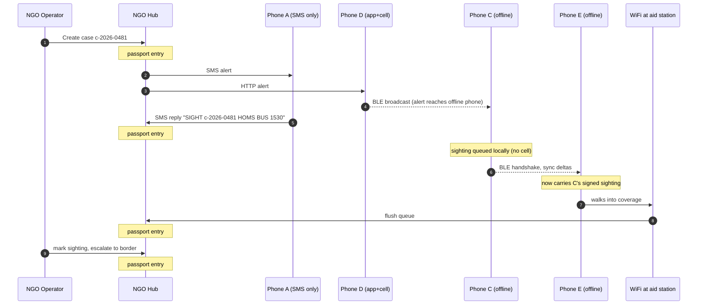

# Architecture diagrams

Three views of how the amber-alert protocol moves a message from an NGO operator to civilians on the ground and back — built to explain the system to a non-technical partner in five minutes.

> **How this maps to the repo's stack.** The diagrams use generic transport labels (BLE peer-to-peer, internet, SMS). In this project those map to:
> - **BLE peer-to-peer** → bitchat mesh (Noise-encrypted, TTL=7, hop-by-hop relay)
> - **Internet (HTTP/WS)** → Nostr fallback + the orchestrator's WebSocket hub
> - **NGO Hub** → the FastAPI orchestrator + SQLite store + NGO React dashboard
> - **SMS** → a future inbound/outbound lane for dumbphones and degraded-cell environments. Not in v1, but the protocol shape (signed JSON envelopes, dedup by `id`, append-only ledger) accommodates it as another transport adapter.

---

## View 1 — Topology

Who is in the system, and how they're wired.

```
                    ┌─────────────────────────────────┐
                    │         NGO HUB (server)        │
                    │   ┌─────────────────────────┐   │
                    │   │  Case database          │   │
                    │   │  Passport ledger        │   │
                    │   │  Fan-out engine         │   │
                    │   │  Trusted-reporter keys  │   │
                    │   └─────────────────────────┘   │
                    └────┬───────────┬───────────┬────┘
                         │           │           │
                    SMS gateway   Internet    (future)
                    (Twilio)      (HTTP/WS)   HF / sat
                         │           │
            ┌────────────┼───────────┼─────────────────────┐
            │            │           │                     │
       ┌────▼────┐  ┌────▼────┐ ┌────▼────┐  ┌──────────┐  │
       │ Phone A │  │ Phone B │ │ Phone D │  │ Phone E  │  │
       │ dumb-   │  │ app +   │ │ app +   │  │ app, no  │  │
       │ phone   │  │ cell    │ │ cell    │  │ cell     │  │
       │ SMS only│  │         │ │         │  │ (offline)│  │
       └─────────┘  └────┬────┘ └────┬────┘  └────┬─────┘  │
                         │           │            │        │
                         │       ┌───▼────┐       │        │
                         └──BLE──┤Phone C ├──BLE──┘        │
                                 │app, no │                │
                                 │cell    │                │
                                 └────────┘                │
                                                           │
                       peer-to-peer BLE store & forward ───┘
```

### Same picture in Mermaid (renders natively on GitHub)

```mermaid
flowchart TB
    subgraph HUB["NGO HUB (orchestrator)"]
        DB[(Case database)]
        LEDGER[(Passport ledger)]
        FANOUT[Fan-out engine]
        KEYS[Trusted-reporter keys]
    end

    SMSGW[SMS gateway<br/>Twilio]
    NET[Internet<br/>HTTP / WS / Nostr]
    SAT[(future)<br/>HF / satellite]

    HUB --- SMSGW
    HUB --- NET
    HUB --- SAT

    A[Phone A<br/>dumbphone<br/>SMS only]
    B[Phone B<br/>app + cell]
    D[Phone D<br/>app + cell]
    C[Phone C<br/>app, no cell]
    E[Phone E<br/>app, no cell]

    SMSGW --- A
    SMSGW --- B
    NET --- B
    NET --- D

    B <-. BLE .-> C
    D <-. BLE .-> C
    C <-. BLE .-> E
```

### Three classes of node

| Node | Talks to hub via | Mesh-capable? | Notes |
|---|---|---|---|
| **Hub** | (it *is* the hub) | — | Single source of truth, holds the passport |
| **Connected phones** (B, D) | SMS + internet | Yes (BLE) | Bridge between hub and offline peers |
| **Offline phones** (C, E) | only via BLE peers | Yes (BLE) | Reach hub eventually, via a connected peer |
| **Dumbphones** (A) | SMS only | No | Always reachable when cell tower works; never participates in mesh |

---

## View 2 — Flow of one alert

The seven-step storyline, end-to-end, for one missing-child case.

```
┌──────────────────────────────────────────────────────────────────┐
│ STEP 1.  NGO operator creates the case                           │
│                                                                  │
│   Operator ──► [HUB]                                             │
│                  │ creates case c-2026-0481                      │
│                  │ writes passport entry #1 (signed by NGO key)  │
└──────────────────┼───────────────────────────────────────────────┘
                   │
┌──────────────────▼───────────────────────────────────────────────┐
│ STEP 2.  Hub fans out across every channel it has                │
│                                                                  │
│   [HUB] ──SMS──► Phone A   (dumbphone receives text)             │
│         ──SMS──► Phone B                                         │
│         ──HTTP─► Phone D   (app fetches alert)                   │
│                     │                                            │
│                     └──BLE broadcast──► Phone C  (offline picks  │
│                                                  it up nearby)   │
└──────────────────────────────────────────────────────────────────┘

┌──────────────────────────────────────────────────────────────────┐
│ STEP 3.  Reporter A replies by SMS  (cell working, trusted)      │
│                                                                  │
│   Phone A ──"SIGHT c-2026-0481 HOMS BUS 1530"──► [HUB]           │
│                                                    │             │
│                                                    └─► passport  │
│                                                       entry #2   │
│                                                       (trusted)  │
└──────────────────────────────────────────────────────────────────┘

┌──────────────────────────────────────────────────────────────────┐
│ STEP 4.  Reporter C has info, no cell — logs locally             │
│                                                                  │
│   Phone C  ─── sighting queued in app ───  (waiting for relay)   │
└──────────────────────────────────────────────────────────────────┘

┌──────────────────────────────────────────────────────────────────┐
│ STEP 5.  Phone C and Phone E pass each other on the street       │
│                                                                  │
│   Phone C  ◄── BLE handshake ──►  Phone E                        │
│            ── sync deltas ──►                                    │
│                                                                  │
│   Phone E now also carries C's queued sighting (signed by C)     │
└──────────────────────────────────────────────────────────────────┘

┌──────────────────────────────────────────────────────────────────┐
│ STEP 6.  Phone E walks into WiFi at an aid station               │
│                                                                  │
│   Phone E ──HTTP──► [HUB]  (flushes everything queued)           │
│                       │                                          │
│                       └─► passport entry #3                      │
│                          (untrusted-but-signed, +37min latency)  │
└──────────────────────────────────────────────────────────────────┘

┌──────────────────────────────────────────────────────────────────┐
│ STEP 7.  Dashboard live-updates. Operator sees the new sighting. │
│          Operator marks it for follow-up, escalates to border.   │
│          That action is itself passport entry #4.                │
└──────────────────────────────────────────────────────────────────┘
```

### Same flow as a Mermaid sequence diagram



---

## View 3 — What the passport looks like at the end

The case file isn't a row in a database — it's an append-only ledger of signed entries. Each entry records *what happened, who said so, and how it got here.*

```
CASE  c-2026-0481   "Maryam, 11"
═══════════════════════════════════════════════════════════════════
#1  09:12  ALERT_ISSUED        NGO-Aleppo       signed ✓  trusted
       └─ name, age, photo_hash, last_seen=Aleppo bus stn

#2  11:40  SIGHTING             reporter-A       signed ✓  trusted
       └─ Homs bus stn, 15:30, "wore red"
       └─ delivered via: SMS  (latency: realtime)

#3  13:02  SIGHTING             reporter-C       signed ✓  untrusted
       └─ Hama market, ~12:15, low confidence
       └─ delivered via: BLE → Phone E → WiFi  (latency: 37min)

#4  13:18  STATUS_UPDATE        NGO-Aleppo       signed ✓  trusted
       └─ escalated to border post Bab al-Hawa

#5  ...
═══════════════════════════════════════════════════════════════════
```

---

## What the three views are meant to make obvious

1. **Two parallel pipes into every person.** SMS (or any always-on cellular layer) and app+BLE (the mesh layer). No one is unreachable as long as *something* is up.
2. **Phones carry data for each other.** The magic moment is Phone C's sighting reaching the hub via Phone E, even though C never had connectivity itself. This is the bitchat store-and-forward property doing real humanitarian work.
3. **The passport accumulates provenance.** Every entry is signed, tagged trusted-vs-untrusted, and stamped with the path it took. The NGO sees the case build itself in real time, and the ledger doubles as the audit trail an authority will want before acting on a tip.
